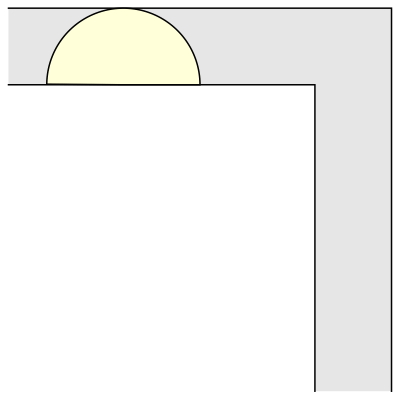

> what is the shape of largest area in the plane that can be moved around a right-angled corner in a two-dimensional hallway of width 1?

My dad has been trying to put a big sofa in the basement for 15 years. Good know it's a harder problem than we thought.

Source: [The moving sofa problem — Dan Romik's home page](https://www.math.ucdavis.edu/~romik/movingsofa/)
